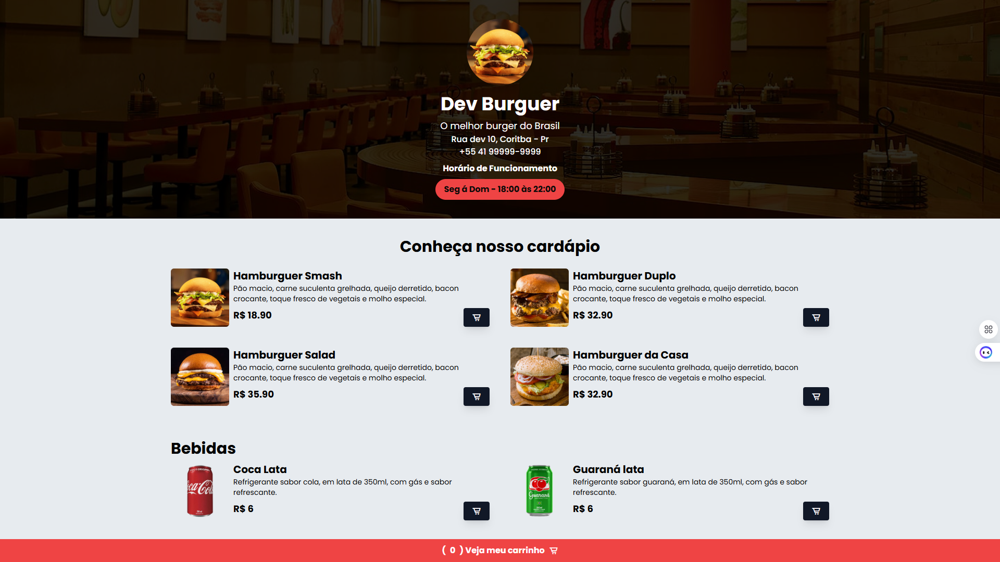

# Project Burguer - Seu Melhor Burger! 🍔

## Descrição do Projeto

Este projeto de uma página web para a hamburgueria "Project Burguer" foi desenvolvido com base em um tutorial do canal YouTube "Sujeito Programador". Através desta experiência prática, pude consolidar meus conhecimentos e aprender muito sobre as tecnologias utilizadas, principalmente a estilização com **Tailwind CSS** e a interatividade com **JavaScript**, aprimorando minhas habilidades no desenvolvimento front-end. O site apresenta um cardápio convidativo com deliciosos hambúrgueres e bebidas, permitindo que os clientes adicionem itens a um carrinho de compras e simulem um pedido completo.



## Funcionalidades

* **Visualização do Cardápio:** Apresenta os hambúrgueres e bebidas disponíveis com seus respectivos nomes, descrições e preços.
* **Adicionar ao Carrinho:** Botões "Adicionar ao Carrinho" em cada item do cardápio permitem que os usuários adicionem produtos ao seu carrinho de compras.
* **Carrinho de Compras:** Um modal acessível através de um botão fixo no rodapé exibe os itens adicionados, o total do pedido e um campo para inserir o endereço de entrega.
* **Finalizar Pedido:** Um botão "Finalizar Pedido" simula a conclusão do pedido, exibindo uma mensagem de sucesso (usando a biblioteca Toastify).
* **Design Responsivo:** O layout da página se adapta a diferentes tamanhos de tela (desktop e mobile).
* **Estilização com Tailwind CSS:** A interface é estilizada utilizando o framework Tailwind CSS, proporcionando um design moderno e responsivo.
* **Ícones com Boxicons:** Utilização da biblioteca Boxicons para ícones, como o carrinho de compras.
* **Notificações com Toastify:** A biblioteca Toastify.js é utilizada para exibir notificações de sucesso ao adicionar itens ao carrinho e ao finalizar o pedido.
* **Fontes do Google Fonts:** Utilização da fonte "Poppins" para uma melhor experiência de leitura.

## Tecnologias Utilizadas

*  **HTML:** Estrutura da página web.
*  **CSS:** Estilização da página (principalmente através do Tailwind CSS).
*  **JavaScript:** Interatividade da página, como adicionar itens ao carrinho, abrir/fechar o modal e finalizar o pedido.
*  **Tailwind CSS:** Framework CSS para estilização rápida e responsiva.
*  **Google Fonts:** Para a fonte "Poppins".
*  **Boxicons:** Biblioteca de ícones.
*  **Toastify.js:** Biblioteca para notificações estilo "toast".

## Como Usar

1.  Clone o repositório para o seu computador:
    ```bash
    git clone [https://github.com/seu-usuario/project-burguer.git](https://github.com/seu-usuario/project-burguer.git)
    ```
    *(Substitua `https://github.com/seu-usuario/project-burguer.git` pelo link do seu repositório)*
2.  Navegue até a pasta do projeto:
    ```bash
    cd project-burguer
    ```
3.  Abra o arquivo `index.html` no seu navegador.

## Estrutura de Arquivos
burguer-project-01/
├── assets/
│   ├── hamb-1.png
│   ├── hamb-2.png
│   ├── hamb-3.png
│   ├── hamb-4.png
│   ├── refri-1.png
│   └── refri-2.png
├── styles/
│   └── output.css     (Arquivo CSS gerado pelo Tailwind CLI)
├── index.html         (Arquivo HTML principal)
└── script.js          (Arquivo JavaScript para a interatividade)

